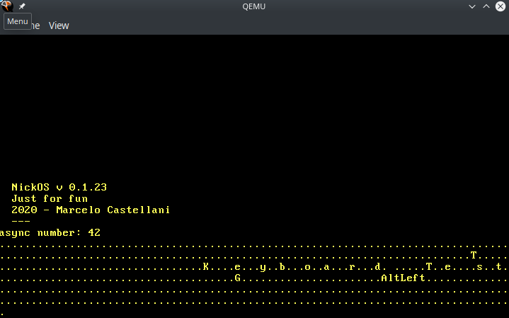

# NickOS

Simple OS written in Rust, just for learning purpouses.

Theory and reference implementation [can be found here.](https://os.phil-opp.com/).

Nick is in honor of my son, Nicolas.

## Building

With `nightly` Rust:

```
$ cargo install cargo-xbuild bootimage

$ rustup component add rust-src

$ rustup component add llvm-tools-preview
```

Now build:

```
$ cargo xbuild
  Downloaded compiler_builtins v0.1.27
  Downloaded 1 crate (135.0 KB) in 2.18s
   Compiling compiler_builtins v0.1.27
   Compiling core v0.0.0 (/home/marcelocastellani/.rustup/toolchains/nightly-x86_64-unknown-linux-gnu/lib/rustlib/src/rust/src/libcore)
   Compiling rustc-std-workspace-core v1.99.0 (/home/marcelocastellani/.rustup/toolchains/nightly-x86_64-unknown-linux-gnu/lib/rustlib/src/rust/src/tools/rustc-std-workspace-core)
   Compiling alloc v0.0.0 (/tmp/cargo-xbuild.f6l5bvMfm2Bw)
    Finished release [optimized] target(s) in 14.01s
   Compiling bootloader v0.9.4
   Compiling nick_os v0.1.0 (/home/marcelocastellani/data/nick_os)
    Finished dev [unoptimized + debuginfo] target(s) in 0.36s


$ cargo bootimage
Building kernel
    Finished dev [unoptimized + debuginfo] target(s) in 0.01s
Building bootloader
   Compiling bootloader v0.9.4 (/home/marcelocastellani/.cargo/registry/src/github.com-1ecc6299db9ec823/bootloader-0.9.4)
    Finished release [optimized + debuginfo] target(s) in 0.77s
Created bootimage for `nick_os` at `/home/marcelocastellani/data/nick_os/target/x86_64-nick_os/debug/bootimage-nick_os.bin`

```

## Running

Install QEMU and run:

```
$ cargo xrun
    Finished dev [unoptimized + debuginfo] target(s) in 0.00s
     Running `bootimage runner target/x86_64-nick_os/debug/nick_os`
Building bootloader
    Finished release [optimized + debuginfo] target(s) in 0.01s
Running: `qemu-system-x86_64 -drive format=raw,file=target/x86_64-nick_os/debug/bootimage-nick_os.bin`
```



## Testing

Just run:

```
$ cargo xtest
   Compiling nick_os v0.1.0 (/home/marcelocastellani/data/nick_os)
    Finished test [unoptimized + debuginfo] target(s) in 0.49s
     Running target/x86_64-nick_os/debug/deps/nick_os-691443f8de1c8fb4
Building bootloader
   Compiling bootloader v0.9.4 (/home/marcelocastellani/.cargo/registry/src/github.com-1ecc6299db9ec823/bootloader-0.9.4)
    Finished release [optimized + debuginfo] target(s) in 0.80s
Running: `qemu-system-x86_64 -drive format=raw,file=/home/marcelocastellani/data/nick_os/target/x86_64-nick_os/debug/deps/bootimage-nick_os-691443f8de1c8fb4.bin -device isa-debug-exit,iobase=0xf4,iosize=0x04 -serial stdio -display none`
Running 4 tests
nick_os::interrupts::test_breakpoint_exception...       [ok]
nick_os::vga_buffer::test_println_simple...     [ok]
nick_os::vga_buffer::test_println_many...       [ok]
nick_os::vga_buffer::test_println_output...     [ok]
     Running target/x86_64-nick_os/debug/deps/nick_os-fc792a54b5ce2d6e
Building bootloader
   Compiling bootloader v0.9.4 (/home/marcelocastellani/.cargo/registry/src/github.com-1ecc6299db9ec823/bootloader-0.9.4)
    Finished release [optimized + debuginfo] target(s) in 0.80s
Running: `qemu-system-x86_64 -drive format=raw,file=/home/marcelocastellani/data/nick_os/target/x86_64-nick_os/debug/deps/bootimage-nick_os-fc792a54b5ce2d6e.bin -device isa-debug-exit,iobase=0xf4,iosize=0x04 -serial stdio -display none`
Running 1 tests
nick_os::trivial_assertion...   [ok]
     Running target/x86_64-nick_os/debug/deps/basic_boot-4c959f26a45bcfbb
Building bootloader
   Compiling bootloader v0.9.4 (/home/marcelocastellani/.cargo/registry/src/github.com-1ecc6299db9ec823/bootloader-0.9.4)
    Finished release [optimized + debuginfo] target(s) in 0.80s
Running: `qemu-system-x86_64 -drive format=raw,file=/home/marcelocastellani/data/nick_os/target/x86_64-nick_os/debug/deps/bootimage-basic_boot-4c959f26a45bcfbb.bin -device isa-debug-exit,iobase=0xf4,iosize=0x04 -serial stdio -display none`
Running 1 tests
basic_boot::test_println...     [ok]
     Running target/x86_64-nick_os/debug/deps/heap_allocation-21c663ef7ceb3cd4
Building bootloader
   Compiling bootloader v0.9.4 (/home/marcelocastellani/.cargo/registry/src/github.com-1ecc6299db9ec823/bootloader-0.9.4)
    Finished release [optimized + debuginfo] target(s) in 0.82s
Running: `qemu-system-x86_64 -drive format=raw,file=/home/marcelocastellani/data/nick_os/target/x86_64-nick_os/debug/deps/bootimage-heap_allocation-21c663ef7ceb3cd4.bin -device isa-debug-exit,iobase=0xf4,iosize=0x04 -serial stdio -display none`
Running 4 tests
heap_allocation::simple_allocation...   [ok]
heap_allocation::large_vec...   [ok]
heap_allocation::many_boxes...  [ok]
heap_allocation::many_boxes_long_lived...       [ok]
     Running target/x86_64-nick_os/debug/deps/should_panic-c0e340c57fc23dde
Building bootloader
   Compiling bootloader v0.9.4 (/home/marcelocastellani/.cargo/registry/src/github.com-1ecc6299db9ec823/bootloader-0.9.4)
    Finished release [optimized + debuginfo] target(s) in 0.80s
Running: `qemu-system-x86_64 -drive format=raw,file=/home/marcelocastellani/data/nick_os/target/x86_64-nick_os/debug/deps/bootimage-should_panic-c0e340c57fc23dde.bin -device isa-debug-exit,iobase=0xf4,iosize=0x04 -serial stdio -display none`
should_panic::should_fail...    [ok]
     Running target/x86_64-nick_os/debug/deps/stack_overflow-a1826cac13f7a13c
Building bootloader
   Compiling bootloader v0.9.4 (/home/marcelocastellani/.cargo/registry/src/github.com-1ecc6299db9ec823/bootloader-0.9.4)
    Finished release [optimized + debuginfo] target(s) in 0.82s
Running: `qemu-system-x86_64 -drive format=raw,file=/home/marcelocastellani/data/nick_os/target/x86_64-nick_os/debug/deps/bootimage-stack_overflow-a1826cac13f7a13c.bin -device isa-debug-exit,iobase=0xf4,iosize=0x04 -serial stdio -display none`
stack_overflow::stack_overflow...       [ok]
```
